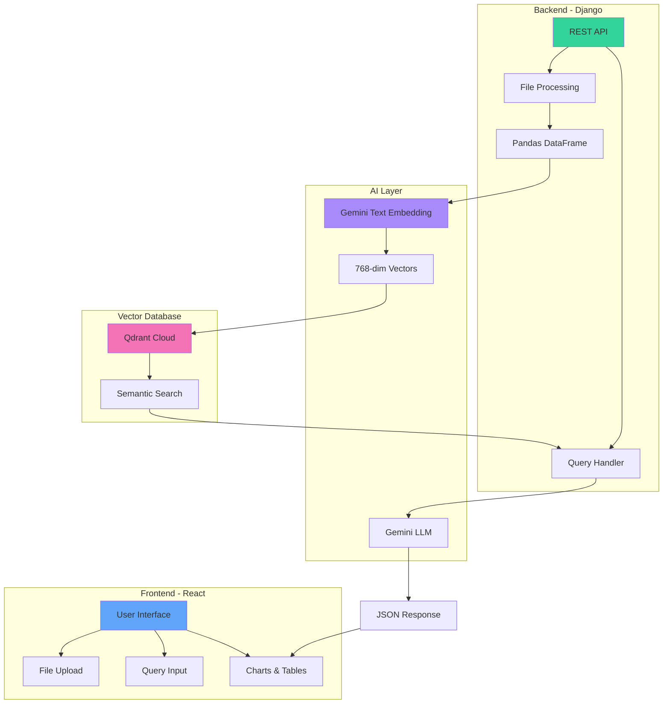
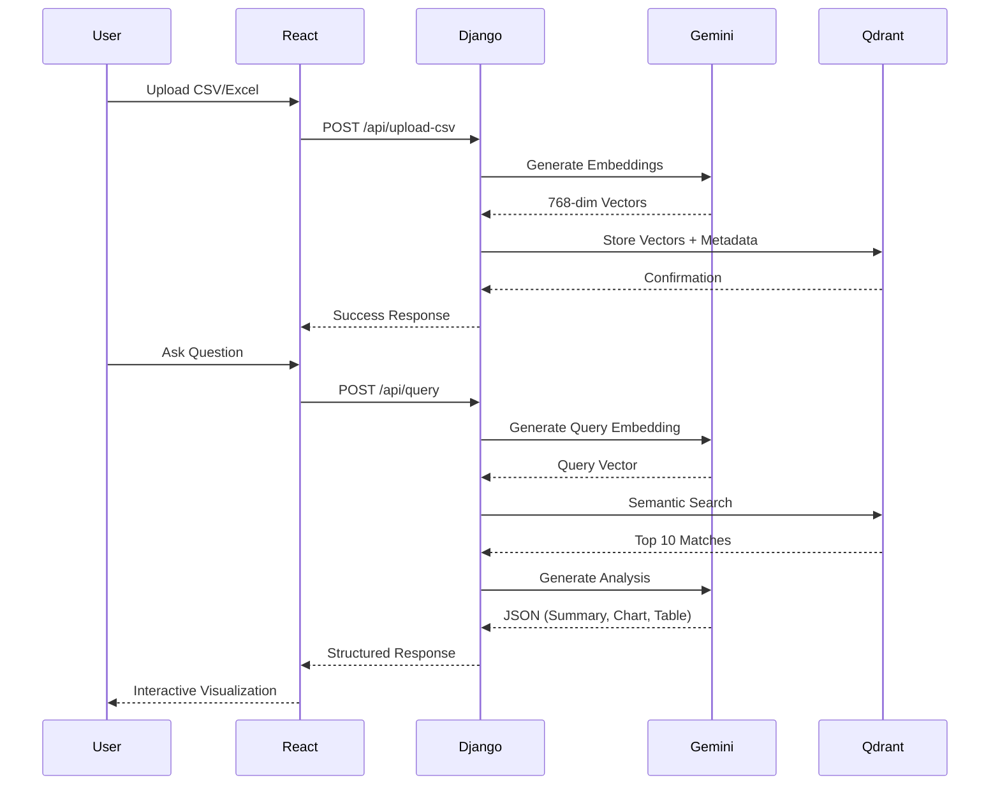

# RAG Real Estate Analyst 🏠🤖

[](https://www.djangoproject.com/)
[](https://reactjs.org/)
[](https://deepmind.google/technologies/gemini/)
[](https://qdrant.tech/)
[](https://www.python.org/)

> An intelligent RAG (Retrieval-Augmented Generation) powered chatbot for real estate data analysis using Google Gemini AI, Qdrant vector database, and interactive visualizations.

## ✨ Features

<table>
<tr>
<td>

### 🧠 **RAG Architecture**
- Vector embeddings with Gemini
- Semantic search with Qdrant
- Context-aware responses
- Smart data retrieval
- Real-time query processing

</td>
<td>

### 📊 **Smart Analytics**
- Price trend analysis
- Location comparisons
- Sales pattern detection
- Property type insights
- Demand forecasting

</td>
</tr>
<tr>
<td>

### 📈 **Interactive Charts**
- Dynamic line charts
- Comparative bar charts
- Auto-generated visualizations
- Recharts integration
- Export functionality

</td>
<td>

### 💾 **Data Management**
- Excel/CSV file upload
- Automatic embedding generation
- Persistent vector storage
- Multi-column analysis
- Pre-loaded data support

</td>
</tr>
</table>

## 🏗️ System Architecture



## 🔄 Data Flow Pipeline



## 🛠️ Tech Stack

<details>
<summary><strong>Backend Technologies</strong></summary>

- **Django** - Web framework
- **Django REST Framework** - API endpoints
- **Google Gemini AI** - LLM & embeddings
  - `gemini-2.0-flash-exp` - Text generation
  - `text-embedding-004` - Vector embeddings
- **Qdrant Cloud** - Vector database
- **Pandas** - Data processing
- **openpyxl** - Excel file support

</details>

<details>
<summary><strong>Frontend Technologies</strong></summary>

- **React 18** - UI framework
- **Recharts** - Chart library
- **Tailwind CSS** - Styling
- **Lucide React** - Icons
- **Fetch API** - HTTP requests

</details>

<details>
<summary><strong>AI & Database</strong></summary>

- **Vector Dimension**: 768
- **Distance Metric**: Cosine Similarity
- **Embedding Model**: Gemini text-embedding-004
- **LLM Model**: Gemini 2.0 Flash Experimental
- **Context Window**: Top 10 relevant records

</details>

## 📁 Project Structure

```
rag_chatbot/
├── 🐍 manage.py                    # Django management
├── ⚙️  .env                         # Environment variables
├── 📦 requirements.txt             # Python dependencies
│
├── 🌐 rag_chatbot/                 # Django project
│   ├── settings.py                # Configuration
│   ├── urls.py                    # URL routing
│   └── wsgi.py                    # WSGI config
│
└── 📱 ragapp/                      # Main Django app
    ├── 🧠 embeddings.py            # Gemini embedding generation
    ├── 🤖 llm.py                   # LLM query processing
    ├── 🗄️  qdrant_client.py        # Vector database client
    ├── 🌐 views.py                 # API endpoints
    └── 🔗 urls.py                  # App URL patterns

React Frontend/
└── ⚛️  components/
    └── 🏠 REC.jsx                  # Main chatbot component
```

## 🚀 Quick Start

### Prerequisites
- 🐍 Python 3.9+
- 📦 Node.js & npm
- 🔑 Google Gemini API Key
- 🗄️ Qdrant Cloud Account

### Backend Setup

1. **Clone Repository**
   ```bash
   git clone https://github.com/your-username/rag-realestate-chatbot.git
   cd rag-realestate-chatbot
   ```

2. **Create Virtual Environment**
   ```bash
   python -m venv venv
   source venv/bin/activate  # Windows: venv\Scripts\activate
   ```

3. **Install Dependencies**
   ```bash
   pip install -r requirements.txt
   ```

4. **Configure Environment**
   ```bash
   # Create .env file in project root
   nano .env
   ```
   
   ```env
   GEMINI_API_KEY=your_gemini_api_key_here
   QDRANT_API_KEY=your_qdrant_api_key_here
   QDRANT_URL=https://your-cluster.qdrant.io
   ```

5. **Run Migrations**
   ```bash
   python manage.py migrate
   ```

6. **Start Django Server**
   ```bash
   python manage.py runserver
   ```
   Backend will run at: http://localhost:8000

### Frontend Setup

1. **Navigate to Frontend**
   ```bash
   cd path/to/React_pj/analysis_chatbot
   ```

2. **Install Dependencies**
   ```bash
   npm install
   ```

3. **Start Development Server**
   ```bash
   npm start
   ```
   Frontend will run at: http://localhost:3000

## 📖 Usage Guide

### 1. 📤 Upload Real Estate Data

**Step 1**: Prepare your CSV/Excel file with these columns:
```
final location, year, city, loc_lat, loc_lng,
total_sales - igr, total sold - igr, flat_sold - igr,
office_sold - igr, shop_sold - igr, commercial_sold - igr,
residential_sold - igr, flat - weighted average rate,
office - weighted average rate, shop - weighted average rate,
total units, total carpet area supplied (sqft),
flat total, shop total, office total, others total
```

**Step 2**: Click "Upload File" button and select your file

**Step 3**: Wait for embedding generation and Qdrant upload

### 2. 🤖 Ask Questions

**Sample Queries:**

📊 **Price Analysis**
```
- Show me price trends over time
- Compare prices across different locations
- What is the average price by year?
```

🏘️ **Location Insights**
```
- Analyze demand patterns by locality
- Which locations have highest prices?
- Show total sales by location
```

📈 **Trend Analysis**
```
- Show yearly sales trends
- Compare demand across years
- What are the market trends?
```

### 3. 📊 View Results

- **Summary**: AI-generated insights
- **Charts**: Interactive visualizations
- **Table**: Detailed data with export option

## 🔌 API Reference

### 📊 Data Endpoints

| Method | Endpoint | Description |
|--------|----------|-------------|
| `GET` | `/api/check-data` | Check if data exists in Qdrant |
| `POST` | `/api/upload-csv` | Upload and embed CSV/Excel file |
| `POST` | `/api/query` | Query RAG system with natural language |

### 📤 Upload CSV
```bash
curl -X POST http://localhost:8000/api/upload-csv \
  -F "file=@real_estate_data.xlsx"
```

**Response:**
```json
{
  "message": "File uploaded and embedded!",
  "rows_processed": 1500,
  "columns": ["locality", "date", "price", "demand"]
}
```

### 🔍 Query Data
```bash
curl -X POST http://localhost:8000/api/query \
  -H "Content-Type: application/json" \
  -d '{
    "query": "Show price trends for Wakad"
  }'
```

**Response:**
```json
{
  "summary": "Wakad shows consistent price growth...",
  "chart": {
    "type": "line",
    "data": [
      {"year": 2020, "price": 5500},
      {"year": 2021, "price": 6200}
    ]
  },
  "table": [
    {"locality": "Wakad", "year": 2020, "price": 5500}
  ]
}
```

## 🧠 How RAG Works

### Step 1: Data Embedding
```python
# Convert each row to semantic text
text = "Location: Wakad, Year: 2023, Price: 6500, Sales: 150..."

# Generate 768-dimensional vector
embedding = gemini.embed_content(text)
# [0.123, -0.456, 0.789, ...]
```

### Step 2: Vector Storage
```python
# Store in Qdrant with metadata
qdrant.upsert(
    collection="realestate",
    points=[{
        "id": 1,
        "vector": embedding,
        "payload": {"locality": "Wakad", "year": 2023, ...}
    }]
)
```

### Step 3: Semantic Search
```python
# User query: "Show Wakad prices"
query_vector = gemini.embed_content("Show Wakad prices")

# Find similar vectors
results = qdrant.search(
    collection="realestate",
    query_vector=query_vector,
    limit=10
)
# Returns most relevant records
```

### Step 4: Context-Aware Response
```python
# Send context + query to Gemini
context = "\n".join([record for record in results])
prompt = f"Context: {context}\nQuery: {user_query}"

response = gemini.generate_content(prompt)
# Returns structured JSON with summary, chart, table
```

## 📈 Key Features Explained

### 🎯 Smart Query Understanding

The system uses semantic search instead of keyword matching:

❌ **Traditional Search**: `"Wakad" AND "price"` (exact match)
✅ **RAG Search**: Understands "Show me Wakad pricing" = "price trends in Wakad"

### 📊 Automatic Visualization

Gemini LLM automatically decides chart type based on query:

- **Line Charts**: Trends over time
- **Bar Charts**: Comparisons across categories

### 💾 Persistent Memory

Once data is uploaded to Qdrant:
- ✅ Survives server restarts
- ✅ No need to re-upload
- ✅ Instant query responses

## 🔧 Development

### Environment Variables
```env
# Required
GEMINI_API_KEY=AIzaSy...
QDRANT_API_KEY=your_key
QDRANT_URL=https://your-cluster.qdrant.io

# Optional
DEBUG=True
ALLOWED_HOSTS=localhost,127.0.0.1
```

### Running Tests
```bash
# Backend tests
python manage.py test

# Check embeddings
python -c "from ragapp.embeddings import generate_embedding; print(len(generate_embedding('test')))"
# Output: 768
```

### Debugging Tips

**Check Qdrant Connection:**
```python
from ragapp.qdrant_client import client
print(client.get_collections())
```

**Test Gemini API:**
```python
import google.generativeai as genai
genai.configure(api_key="your_key")
model = genai.GenerativeModel('gemini-2.0-flash-exp')
response = model.generate_content("Hello")
print(response.text)
```

## 📊 Performance Metrics

- ⚡ **Query Response**: < 3 seconds
- 🔄 **Embedding Speed**: ~100 rows/minute
- 💾 **Vector Storage**: 768 dimensions per record
- 🎯 **Search Accuracy**: Semantic similarity > 0.7
- 📈 **Context Retrieval**: Top 10 relevant records

## 🚀 Deployment

### Docker Deployment

**Dockerfile:**
```dockerfile
FROM python:3.11-slim

WORKDIR /app
COPY requirements.txt .
RUN pip install --no-cache-dir -r requirements.txt

COPY . .
EXPOSE 8000

CMD ["python", "manage.py", "runserver", "0.0.0.0:8000"]
```

**Build & Run:**
```bash
docker build -t rag-chatbot .
docker run -p 8000:8000 --env-file .env rag-chatbot
```

### Cloud Platforms

- ☁️ **Heroku**: Django deployment with PostgreSQL
- 🌐 **Railway**: Easy Django + Qdrant setup
- ⚡ **Vercel**: Frontend React deployment
- 🚀 **Google Cloud Run**: Containerized deployment

## 🛡️ Security Best Practices

- 🔐 **API Keys**: Never commit `.env` to git
- 🌐 **CORS**: Configure allowed origins in Django
- ✅ **Input Validation**: File size limits (50MB max)
- 📝 **Error Handling**: Sanitized error messages
- 🔒 **HTTPS**: Always use in production

## 📋 Sample Data Format

**Input CSV:**
```csv
final location,year,total_sales - igr,flat - weighted average rate
Wakad,2020,15000000,5500
Wakad,2021,18000000,6200
Aundh,2020,20000000,7500
```

**After Processing:**
- ✅